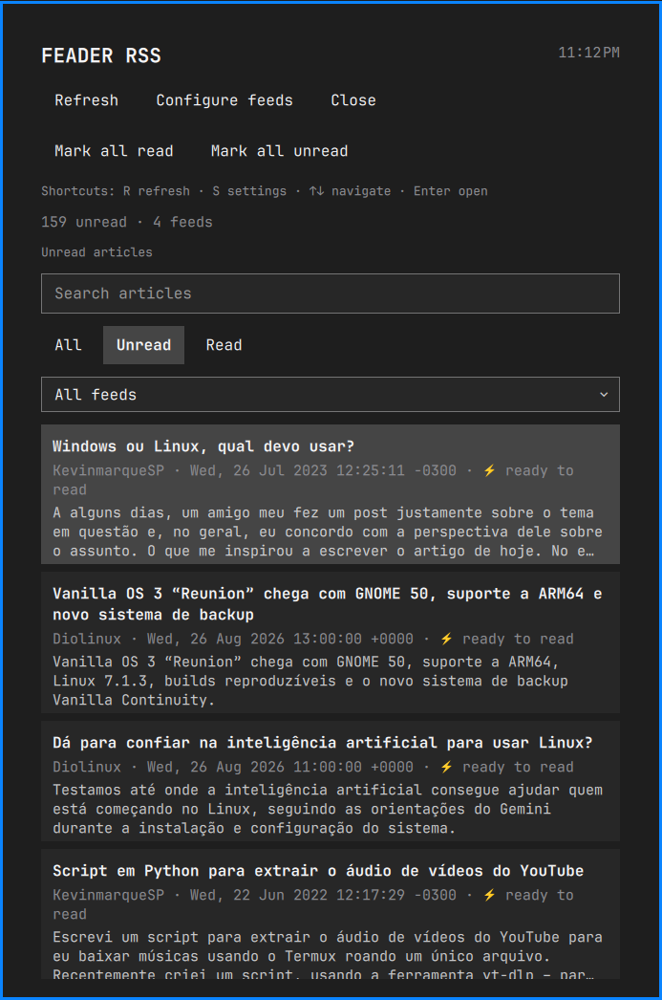
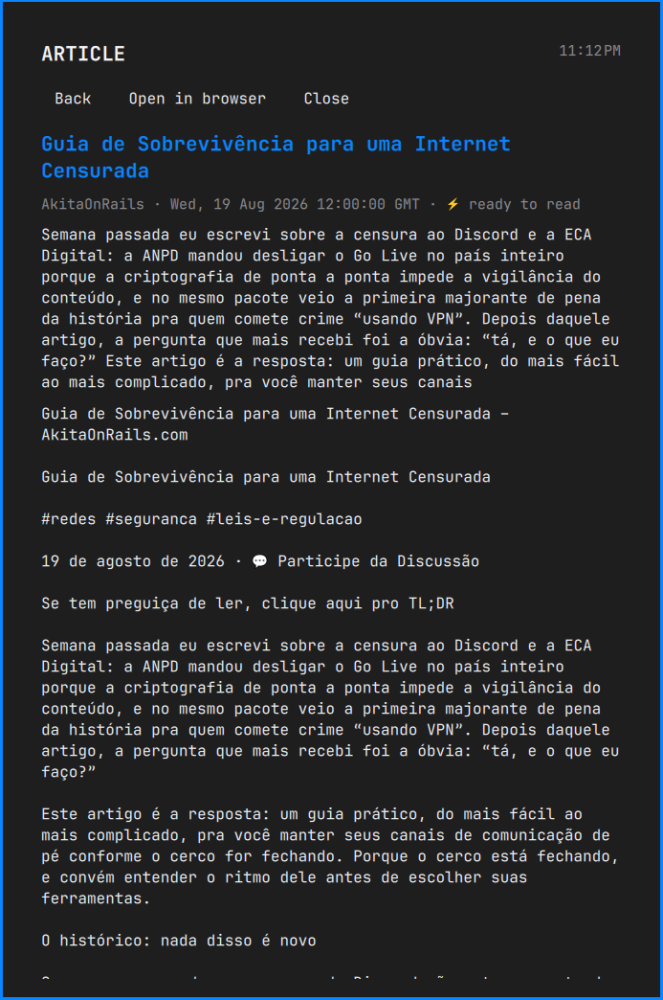
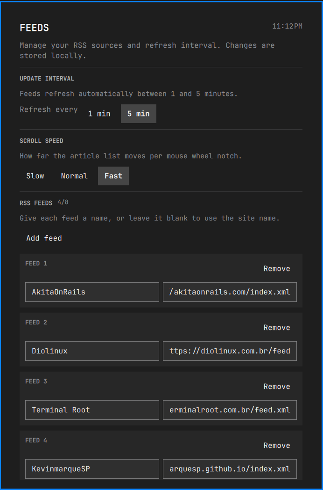

# Feader RSS

A persistent RSS reader for the Omarchy shell, built as a Quickshell plugin.

<p align="center">
  
  
</p>

<p align="center">
  
  
  
</p>

## Local installation

To install a local copy during development:

```bash
./scripts/install.sh
```

The installer validates the manifest, removes the previous plugin files, and
copies only the required files to
`~/.config/omarchy/plugins/io.github.kitsunesemcalda.feader-rss/`, then enables
the widget in the right bar section. It preserves your feed configuration and
creates a timestamped backup of the configuration and article cache, then
keeps the active article cache so read/unread state persists across updates. If
the shell does not detect the copy immediately, run
`omarchy restart shell`.

Backups are stored separately in
`~/.local/state/omarchy/rss-reader/backups/`. To create one manually, run
`./scripts/backup.sh`.
To restore a backup, run `./scripts/restore.sh /path/to/backup`; the current data is
backed up first.

## Distribution through the Omarchy plugin system

The standard distribution format is a public Git repository with
`manifest.json` at its root. After publishing this repository, users can
install it with:

```bash
omarchy plugin add https://github.com/KitsuneSemCalda/Feader-RSS.git --enable
```

Omarchy validates the manifest before copying the plugin to
`~/.config/omarchy/plugins/`. The shell does not execute an install hook.

The runtime requires Omarchy's Quattro shell, `python3`, and network access to
the configured RSS/Atom feeds. It runs with the user's permissions inside the
long-running shell process. The helper invokes `python3`, creates the state
directory with `mkdir`, opens article URLs in the browser, and may call
`omarchy-notification-send` for new posts. No elevated privileges, background
service, or remote build is required.

## Feeds and persistence

Create `~/.config/omarchy/rss-reader.json`:

```json
{
  "maxItems": 200,
  "refreshMinutes": 5,
  "feeds": []
}
```

`refreshMinutes` accepts values between `1` and `5`; the default is to refresh
feeds automatically every 5 minutes.

You can also open the reader and choose **Configure feeds** to edit the feed
name and URL without leaving the application. The configuration screen supports
adding and removing feeds, validation of `http`/`https` URLs, keyboard focus,
arrow-key navigation, `Enter`, `Tab`, and `Escape`. Press `s` from the reader to
open it directly. Duplicate feed URLs are rejected.

The reader provides search, filters for all/read/unread articles, and a feed
filter. These preferences are stored with the article state and restored when
the reader starts. Failed feeds are reported in the status line without hiding
articles successfully loaded from the other feeds.

Articles are stored in
`~/.local/state/omarchy/rss-reader/items.json`. Left-click opens the reader,
middle-click refreshes it, and right-click opens the first unread article.
Clicking an article marks it as read and loads the full text inside the reader;
the detail view also offers a button to open the original page in the browser.

## Theme and notifications

The panel uses Omarchy's live `Color` and `Style` tokens, so surfaces, focus
states, spacing, typography, and buttons follow the active theme. When a
refresh finds posts that were not present in the persisted article store, the
plugin sends one low-urgency Omarchy notification summarizing the new posts.
The initial import does not notify, so a fresh installation does not produce a
burst of alerts.

## Tests

Run the dependency-free tests, backup round-trip checks, and Omarchy validation
checks with:

```bash
python3 -m unittest discover -s tests -v
omarchy plugin validate .
qmllint -I "$OMARCHY_PATH/shell" BarWidget.qml Panel.qml
```

GitHub Actions runs the Python tests, manifest validation, installer syntax
checks, and whitespace checks on pushes and pull requests. Pushing a tag such
as `v0.1.0` creates a GitHub Release with a plugin archive attached.
